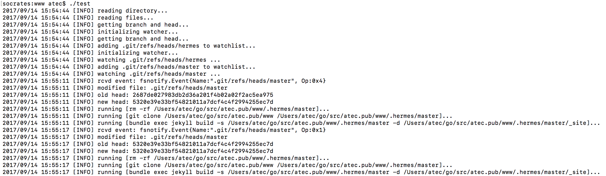

# hermes
## goal
### hermes is an attempt to vertically integrate "DevOps" responsibilities into a seamless workflow with revision control and public cloud infrastructure
## motivation
personally as a developer i really want one concrete feature
- on `git checkout -b experiment` I get a sandboxed environment deployed accessible to QA (for example) through a private domain (e.g. "experiment.hermes.pub") and on subsequent changes to that branch the environment behaves as a normal CI/CD pipeline would

## current implementation
right now master compiles down to a post-receive git hook which builds my personal public website's (if you want to call it that) views with jekyll, builds a web server with go, and provisions a compute resource with gce. 

it then configures the resource by shipping all the products of the make process to the instance. it _does not_ deploy the service properly in an automated way as of yet (because i'm losing a fight with gce on how to copy files to directories owned by root, i as of now can't ship the systemd unit file to `/etc/systemd/system`)

atm i'm moving to aws (on the `aws ` branch) because google is evil and `aws-shell` is awesome

## why are you using shell commands for everything
because it's the main api i know how to hook into (i like scripting) and i'm using it as a layer of indirection to the REST of most of these providers. it shouldn't be permanent, and i hope to convert many of these resource requests into proper HTTP methods

## why not use some combination of (tool1,...)
i'd like to have some room for my own creative expression of course, but that answer doesn't really satisfy the incurious, who for some bizarre reason would rather be held hostage by some other developers' black boxes and bolt together some non-orthogonal combination of them to build a solution that "works" while learning exactly nothing. this servile attitude is for some reason held by many of the engineers i meet. i thought engineers liked building stuff

the first answer is that this particular implementation is dependent on public cloud providers (aws and gce) and git, so there are some primitive building blocks that i have no plans to build myself, and in the future i'd probably want to let Terraform deal with the provisioning so that it's provider agnostic once i figure out how to hook into their api (i have no plans to weaken my dependency on git. git is the one true vcs preached by the gospel of Unix)

what this aims to be in the short to medium term is a reference implementation of an interface for my own personal website's (again, if you want to call it that) needs and dependencies (right now jekyll and go), then use that as a poc to add support for other development frameworks to make it developer agnostic with as few opinions as possible (besides git. use git)

i am open to the idea that modular parts of this project's goal are best done by some other tools (such as the CI/CD after the environment is already provisioned), but the criteria of "seamlessness" is pretty high here, and the flavors of the month everyone points to in my experience are anything but seamless (especially Jenkins. i'm not using Jenkins. get over it)

## influences
clearly this workflow is inspired by Heroku. they've really done some excellent stuff. true artists